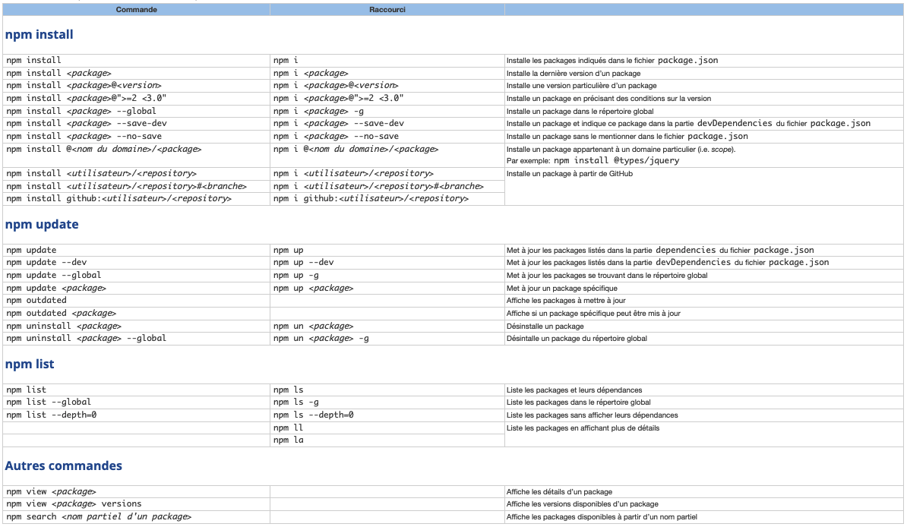

- [1. npm](#1-npm)
  - [1.1. Liste des commandes de base](#11-liste-des-commandes-de-base)
  - [1.2. Options de package.json](#12-options-de-packagejson)
  - [1.3. Dépendances de développement](#13-dépendances-de-développement)
    - [1.3.1. Liste des dépendances :](#131-liste-des-dépendances-)
    - [1.3.2. Scipts](#132-scipts)
- [2. Git](#2-git)
  - [2.1. Installation](#21-installation)
  - [2.2. Vérification de version](#22-vérification-de-version)
  - [2.3. Configuration](#23-configuration)
    - [2.3.1. Error message](#231-error-message)
  - [2.4. Initialisation](#24-initialisation)
  - [2.5. Les commits](#25-les-commits)
    - [2.5.1. Rédaction des commits](#251-rédaction-des-commits)
      - [2.5.1.1. Les types](#2511-les-types)
      - [2.5.1.2. Modèle de commit](#2512-modèle-de-commit)
  - [2.6. Les branches](#26-les-branches)
  - [2.7. Les remotes](#27-les-remotes)
  - [2.8. Fetch](#28-fetch)
  - [2.9. Les tags](#29-les-tags)
  - [2.10. Gitignore](#210-gitignore)
  - [2.11. Diff](#211-diff)
- [3. Badges Markdown](#3-badges-markdown)
  - [3.1. Grandes tailles](#31-grandes-tailles)
  - [3.2. Badges normaux](#32-badges-normaux)
  - [3.3. Markdown Emoji Markup](#33-markdown-emoji-markup)
- [4. Hiérarchie des commentaires](#4-hiérarchie-des-commentaires)

---

# 1. npm


## 1.1. Liste des commandes de base



## 1.2. Options de package.json

[https://docs.npmjs.com/cli/v8/configuring-npm/package-json](https://docs.npmjs.com/cli/v8/configuring-npm/package-json)

## 1.3. Dépendances de développement

### 1.3.1. Liste des dépendances :

- Webpack :

  ```json
  "webpack": "latest",
  "webpack-cli": "latest",
  ```

- babel-loader :

  ```json
  "@babel/core": "latest",
  "@babel/plugin-transform-arrow-functions": "latest",
  "@babel/preset-env": "latest",
  "babel-loader": "latest",
  ```

- Sass :

  ```json
  "sass": "latest",
  ```

- Autoprefixer :

  ```json
  "autoprefixer": "latest",
  "postcss": "latest",
  "postcss-cli": "latest",
  ```

- Nettoyage du CSS :

  ```json
  "purgecss": "latest",
  ```

- Linter :

  ```json
  "eslint": "latest",
  ```

- Testing :

  ```json
  "jest": "latest",
  "@types/jest": "latest",
  "@babel/plugin-transform-arrow-functions": "latest",
  "@babel/preset-env": "latest"
  ```

### 1.3.2. Scipts

```json
"sass": "sass ./sass/main.scss ./dist/css/style.css --watch --style compressed",
"build": "webpack --config webpack.config.js",
"purge": "purgecss --css ./dist/css/style.css --content ./index.html ./dist/js/bootstrap.bundle.min.js ./dist/js/index.bundle.min.js --output ./dist/css/ -font -keyframes",
"prefix": "postcss ./dist/css/style.css --use autoprefixer -d ./dist/css/",
"test": "jest --watch --colors --verbose",
"test-cov": "jest --coverage",
"server-src": "live-server --port=8080 --open=\"src/index.html\"",
```

---

# 2. Git


[Site officiel](http://git-scm.com)

## 2.1. Installation

`$ brew install git`

## 2.2. Vérification de version

`$ git --version`

## 2.3. Configuration

Pour un apperçu de la configuration actuelle :

`$ git config --list`

Enregistrer son nom et son e-mail :

`$ git config --global user.name "John Doe"`

`$ git config --global user.email "johndoe@example.com"`

Activer les couleurs :

`$ git config --global color.diff auto`

`$ git config --global color.status auto`

`$ git config --global color.branch auto`

Définir VSCode come éditeur par défaut :

`$ git config --global core.editor "code --wait"`

`$ git config --global diff.tool vscode`

`$ git config --global merge.tool vscode`

Définir _main_ comme nom de branche par défaut :

`git config --global init.defaultBranch main`

### 2.3.1. Error message

Il peut parfois arriver qu’un message d’erreur apparaisse lors d’un commit ou d’un merge de type :

```bash
error: There was a problem with the editor 'core --wait'.Please supply the message using either -m or -F option.
```

Dans ce cas, ouvrir la palette de commande (command + shift + p)
Taper ‘code’ dans l’invite et sélectionner la commande :

`Shell Command: Install 'code' command in PATH`

## 2.4. Initialisation

Nouveau projet :

`$ git init`

Cloner un projet existant :

`$ git clone <https://mon-repo-distant>`

## 2.5. Les commits

Inclures tous les fichiers modifiés au prochain commit :

`$ git add -A`

Commit :

`$ git commit -m "message de commit"`

Modifier le message du dernier commit :

`$ git commit --amend -m "nouveau message"`

Annuler le dernier commit :

`$ git revert HEAD`

notes : Va créer un nouveau commit “d’annulation” ce qui ne posera pas de problème lors d’un prochain push vers un dépot distant.

### 2.5.1. Rédaction des commits

#### 2.5.1.1. Les types

- feat : Ajout d’ue nouvelle fonctionnalité
- fix : Correction d’un bug
- build : Changement lié au systèmes de build ou qui concerne les dépendances.
- docs : Ajout ou modification de la documentation
- perf : Amélioration des performances
- refactor : Remaniment du code qui ne modifie pas le rendu.
- style : Changement lié au style du code
- test : Ajout ou modification de tests
- revert : Annulation d’un précédent commit
- chore : toute autre modification

#### 2.5.1.2. Modèle de commit

```bash
[FIX] index (#9): change alt text images

Alt text images must be different than images name in "Activity"

section.Closes #9
```

## 2.6. Les branches

Lister les branches locales :

`$ git branch`

Lister les branches distantes :

`$ git branch -r`

Lister toutes les branches :

`$ git branch -a -v`

Créer une nouvelle branche :

`$ git branch <ma-nouvelle-branche>`

Se rendre sur une autre branche :

`$ git checkout <ma-branche-de-destination>`

Créer une nouvelle branche et aller directement dessus :

`$ git checkout -b <ma-nouvelle-branche>`

Renommer une branche :

`$ git branch -m <ancien-nom> <nouveau-nom>`

Supprimer une branche locale :

`$ git branch -d <ma-branche>`

Forcer la suppression d’une branche :

`$ git branch -D <ma-branche>`

Supprimer une branche distante :

`$ git push <remote> --delete <ma-branche>`

Publier une branche sur le dépot distant :

`$ git push <remote> <ma-branche>`

Récupérer une branche distante :

`$ git pull <remote> <ma-branche>`

Merger une branche en conservant l’historique :

`$ git merge --no-ff <branche-à-merger>`

## 2.7. Les remotes

Lister les remotes :

`$ git remote`

Créer une remote :

`$ git remote add origin <https://mon-repo-distant>`

Mettre à jour le HEAD aprés changement de branche par défaut :

`$ git remote set-head origin -a`

## 2.8. Fetch

Mise à jour des changements entre dépot local et distant :

`$ git fetch <remote>`

Suppression des branches supprimées et réstées en mémoire localement :

`$ git fetch --prune`

## 2.9. Les tags

Repertorier les tags :

`$ git tag`

Création d’un tag simple :

`$ git tag <tagname>`

(tagname est à remplacer par un identifiant sémantique de type v1.0.0)

Création d’un tag annoté :

`$ git tag -a <tagname>`

Un tag annoté contiendra des métadonnées supplémentaires sous forme de message, telles que le nom du créateur, la date, son email.

Envoyer le tag sur un dépot distant :

`$ git push origin <tagname>`

## 2.10. Gitignore

Pour désindexer des fichiers ajoutés au .gitignore :

`$ git rm -r --cached .`

`$ git add .`

`$ git commit -m "fixed untracked files`

## 2.11. Diff

`$ git diff main..develop`

Indique les différence entre la brache Main et la branche Develop.

---

# 3. Badges Markdown


## 3.1. Grandes tailles

[GitHub - a11y-badges/a11y-markdown-badges: accessible markdown badges for profile and project READMEs (and everything else!) via a11y badges](https://github.com/a11y-badges/a11y-markdown-badges)

## 3.2. Badges normaux

[GitHub - Ileriayo/markdown-badges: Badges for your personal developer branding, profile, and projects.](https://github.com/Ileriayo/markdown-badges)

[GitHub - alexandresanlim/Badges4-README.md-Profile: 👩‍💻👨‍💻 Improve your README.md profile with these amazing badges.](https://github.com/alexandresanlim/Badges4-README.md-Profile)

[150+ Badges for GitHub](https://dev.to/envoy_/150-badges-for-github-pnk)

## 3.3. Markdown Emoji Markup

[Complete list of github markdown emoji markup](https://gist.github.com/rxaviers/7360908)

---

# 4. Hiérarchie des commentaires

```html
<!--  !   Red     - End -->
<!--  -   Orange  - End -->
<!--  +   Yellow  - End -->
<!--  ^   Green   - End -->
<!--  =   Blue    - End -->
<!--  *   Pink    - End -->
```

---
