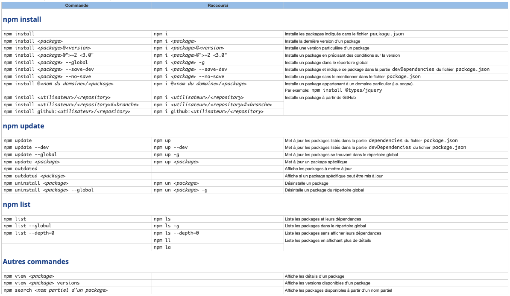
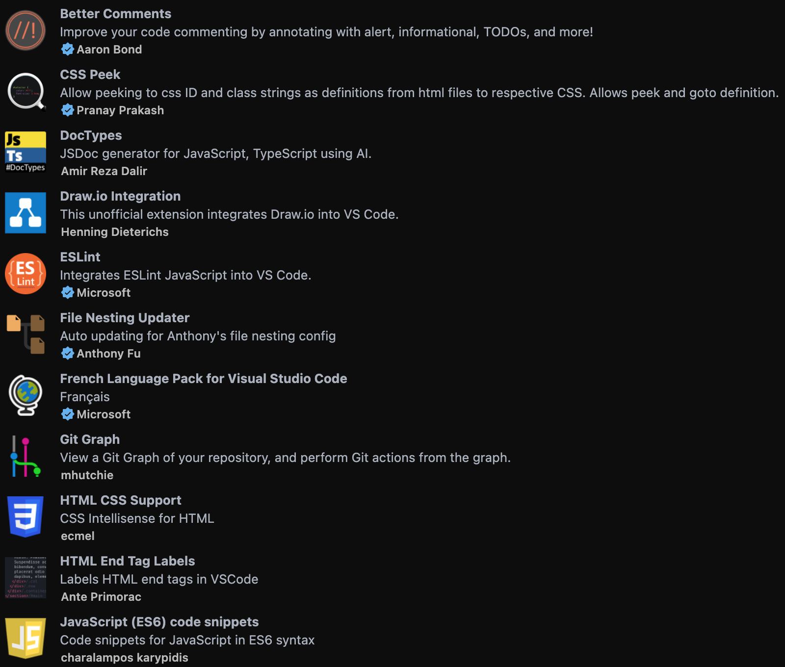
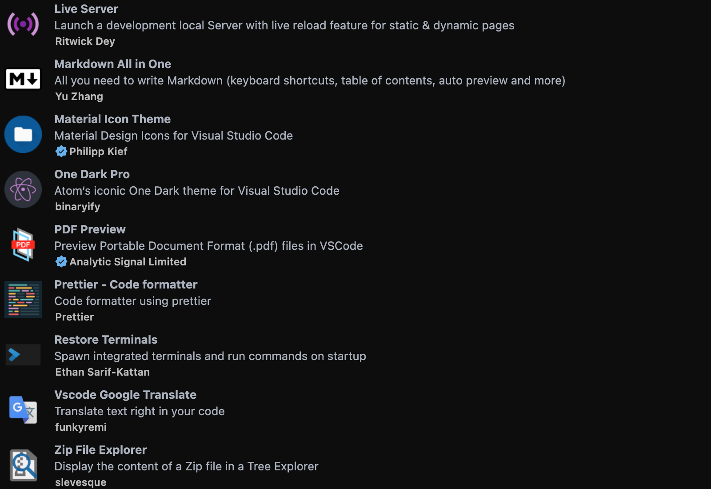

# 1. Matrice

## 1.1. Table des matières

- [1. Matrice](#1-matrice)
  - [1.1. Table des matières](#11-table-des-matières)
  - [1.2. npm](#12-npm)
    - [1.2.1. Liste des commandes de base](#121-liste-des-commandes-de-base)
    - [1.2.2. Options de package.json](#122-options-de-packagejson)
    - [1.2.3. Dépendances de développement](#123-dépendances-de-développement)
    - [1.2.4. Scripts](#124-scripts)
  - [1.3. Git](#13-git)
    - [1.3.1. Installation](#131-installation)
    - [1.3.2. Vérification de version](#132-vérification-de-version)
    - [1.3.3. Configuration](#133-configuration)
      - [1.3.3.1. Error message](#1331-error-message)
    - [1.3.4. Initialisation](#134-initialisation)
    - [1.3.5. Les commits](#135-les-commits)
      - [1.3.5.1. Rédaction des commits](#1351-rédaction-des-commits)
        - [1.3.5.1.1. Les types](#13511-les-types)
        - [1.3.5.1.2. Modèle de commit](#13512-modèle-de-commit)
    - [1.3.6. Les branches](#136-les-branches)
    - [1.3.7. Les remotes](#137-les-remotes)
    - [1.3.8. Fetch](#138-fetch)
    - [1.3.9. Les tags](#139-les-tags)
    - [1.3.10. Gitignore](#1310-gitignore)
    - [1.3.11. Diff](#1311-diff)
  - [1.4. Badges Markdown](#14-badges-markdown)
    - [1.4.1. Grandes tailles](#141-grandes-tailles)
    - [1.4.2. Badges normaux](#142-badges-normaux)
    - [1.4.3. Markdown Emoji Markup](#143-markdown-emoji-markup)
  - [1.5. Hiérarchie des commentaires](#15-hiérarchie-des-commentaires)
  - [1.6. Visual Studio Code](#16-visual-studio-code)
    - [1.6.1. Extensions](#161-extensions)
    - [1.6.2. Configuration](#162-configuration)

---

## 1.2. npm


### 1.2.1. Liste des commandes de base



### 1.2.2. Options de package.json

[https://docs.npmjs.com/cli/v8/configuring-npm/package-json](https://docs.npmjs.com/cli/v8/configuring-npm/package-json)

### 1.2.3. Dépendances de développement

- Webpack :

  ```json
  "webpack": "latest",
  "webpack-cli": "latest",
  ```

- babel-loader :

  ```json
  "@babel/core": "latest",
  "@babel/plugin-transform-arrow-functions": "latest",
  "@babel/preset-env": "latest",
  "babel-loader": "latest",
  ```

- Sass :

  ```json
  "sass": "latest",
  ```

- Autoprefixer :

  ```json
  "autoprefixer": "latest",
  "postcss": "latest",
  "postcss-cli": "latest",
  ```

- Nettoyage du CSS :

  ```json
  "purgecss": "latest",
  ```

- Linter :

  ```json
  "eslint": "latest",
  ```

- Testing :

  ```json
  "jest": "latest",
  "@types/jest": "latest",
  "@babel/plugin-transform-arrow-functions": "latest",
  "@babel/preset-env": "latest",
  ```

- Jsdoc :

  ```json
  "jsdoc": "latest",
  ```

### 1.2.4. Scripts

```json
"sass": "sass ./sass/main.scss ./dist/css/style.css --watch --style compressed",
"build": "webpack --config webpack.config.js",
"purge": "purgecss --css ./dist/css/style.css --content ./index.html ./dist/js/bootstrap.bundle.min.js ./dist/js/index.bundle.min.js --output ./dist/css/ -font -keyframes",
"prefix": "postcss ./dist/css/style.css --use autoprefixer -d ./dist/css/",
"test": "jest --watch --colors --verbose",
"test-cov": "jest --coverage",
"server-src": "live-server --port=8080 --open=\"src/index.html\"",
"doc": "jsdoc -c ./jsdoc.conf.json",
```

---

## 1.3. Git


[Site officiel](http://git-scm.com)

### 1.3.1. Installation

`$ brew install git`

### 1.3.2. Vérification de version

`$ git --version`

### 1.3.3. Configuration

Pour un apperçu de la configuration actuelle :

`$ git config --list`

Enregistrer son nom et son e-mail :

`$ git config --global user.name "John Doe"`

`$ git config --global user.email "johndoe@example.com"`

Activer les couleurs :

`$ git config --global color.diff auto`

`$ git config --global color.status auto`

`$ git config --global color.branch auto`

Définir VSCode come éditeur par défaut :

`$ git config --global core.editor "code --wait"`

`$ git config --global diff.tool vscode`

`$ git config --global merge.tool vscode`

Définir _main_ comme nom de branche par défaut :

`git config --global init.defaultBranch main`

#### 1.3.3.1. Error message

Il peut parfois arriver qu’un message d’erreur apparaisse lors d’un commit ou d’un merge de type :

```bash
error: There was a problem with the editor 'core --wait'.Please supply the message using either -m or -F option.
```

Dans ce cas, ouvrir la palette de commande (command + shift + p)
Taper ‘code’ dans l’invite et sélectionner la commande :

`Shell Command: Install 'code' command in PATH`

### 1.3.4. Initialisation

Nouveau projet :

`$ git init`

Cloner un projet existant :

`$ git clone <https://mon-repo-distant>`

### 1.3.5. Les commits

Inclures tous les fichiers modifiés au prochain commit :

`$ git add -A`

Commit :

`$ git commit -m "message de commit"`

Modifier le message du dernier commit :

`$ git commit --amend -m "nouveau message"`

Annuler le dernier commit :

`$ git revert HEAD`

notes : Va créer un nouveau commit “d’annulation” ce qui ne posera pas de problème lors d’un prochain push vers un dépot distant.

#### 1.3.5.1. Rédaction des commits

##### 1.3.5.1.1. Les types

- feat : Ajout d’ue nouvelle fonctionnalité
- fix : Correction d’un bug
- build : Changement lié au systèmes de build ou qui concerne les dépendances.
- docs : Ajout ou modification de la documentation
- perf : Amélioration des performances
- refactor : Remaniment du code qui ne modifie pas le rendu.
- style : Changement lié au style du code
- test : Ajout ou modification de tests
- revert : Annulation d’un précédent commit
- chore : toute autre modification

##### 1.3.5.1.2. Modèle de commit

```bash
[FIX] index (#9): change alt text images

Alt text images must be different than images name in "Activity"

section.Closes #9
```

### 1.3.6. Les branches

Lister les branches locales :

`$ git branch`

Lister les branches distantes :

`$ git branch -r`

Lister toutes les branches :

`$ git branch -a -v`

Créer une nouvelle branche :

`$ git branch <ma-nouvelle-branche>`

Se rendre sur une autre branche :

`$ git checkout <ma-branche-de-destination>`

Créer une nouvelle branche et aller directement dessus :

`$ git checkout -b <ma-nouvelle-branche>`

Renommer une branche :

`$ git branch -m <ancien-nom> <nouveau-nom>`

Supprimer une branche locale :

`$ git branch -d <ma-branche>`

Forcer la suppression d’une branche :

`$ git branch -D <ma-branche>`

Supprimer une branche distante :

`$ git push <remote> --delete <ma-branche>`

Publier une branche sur le dépot distant :

`$ git push <remote> <ma-branche>`

Récupérer une branche distante :

`$ git pull <remote> <ma-branche>`

Merger une branche en conservant l’historique :

`$ git merge --no-ff <branche-à-merger>`

### 1.3.7. Les remotes

Lister les remotes :

`$ git remote`

Créer une remote :

`$ git remote add origin <https://mon-repo-distant>`

Mettre à jour le HEAD aprés changement de branche par défaut :

`$ git remote set-head origin -a`

### 1.3.8. Fetch

Mise à jour des changements entre dépot local et distant :

`$ git fetch <remote>`

Suppression des branches supprimées et réstées en mémoire localement :

`$ git fetch --prune`

### 1.3.9. Les tags

Repertorier les tags :

`$ git tag`

Création d’un tag simple :

`$ git tag <tagname>`

(tagname est à remplacer par un identifiant sémantique de type v1.0.0)

Création d’un tag annoté :

`$ git tag -a <tagname>`

Un tag annoté contiendra des métadonnées supplémentaires sous forme de message, telles que le nom du créateur, la date, son email.

Envoyer le tag sur un dépot distant :

`$ git push origin <tagname>`

### 1.3.10. Gitignore

Pour désindexer des fichiers ajoutés au .gitignore :

`$ git rm -r --cached .`

`$ git add .`

`$ git commit -m "fixed untracked files`

### 1.3.11. Diff

`$ git diff main..develop`

Indique les différence entre la brache Main et la branche Develop.

---

## 1.4. Badges Markdown


### 1.4.1. Grandes tailles

[GitHub - a11y-badges/a11y-markdown-badges: accessible markdown badges for profile and project READMEs (and everything else!) via a11y badges](https://github.com/a11y-badges/a11y-markdown-badges)

### 1.4.2. Badges normaux

[GitHub - Ileriayo/markdown-badges: Badges for your personal developer branding, profile, and projects.](https://github.com/Ileriayo/markdown-badges)

[GitHub - alexandresanlim/Badges4-README.md-Profile: 👩‍💻👨‍💻 Improve your README.md profile with these amazing badges.](https://github.com/alexandresanlim/Badges4-README.md-Profile)

[150+ Badges for GitHub](https://dev.to/envoy_/150-badges-for-github-pnk)

### 1.4.3. Markdown Emoji Markup

[Complete list of github markdown emoji markup](https://gist.github.com/rxaviers/7360908)

---

## 1.5. Hiérarchie des commentaires

```html
<!--  !   Red     - End -->
<!--  -   Orange  - End -->
<!--  +   Yellow  - End -->
<!--  ^   Green   - End -->
<!--  =   Blue    - End -->
<!--  *   Pink    - End -->
```

---

## 1.6. Visual Studio Code

### 1.6.1. Extensions




### 1.6.2. Configuration

```json
{
  "workbench.startupEditor": "none",
  "workbench.editor.untitled.hint": "hidden",
  "workbench.iconTheme": "material-icon-theme",
  "workbench.colorTheme": "One Dark Pro",

  "workbench.colorCustomizations": {
    "[One Dark Pro]": {
      "editor.background": "#0d0d0d",
      "sideBar.background": "#0d0d0d",
      "activityBar.background": "#0d0d0d",
      "editorGroupHeader.tabsBackground": "#0d0d0d",
      "titleBar.activeBackground": "#0d0d0d",
      "statusBar.background": "#0d0d0d",
      "terminal.background": "#0d0d0d",
      "list.focusHighlightForeground": "#00EEFF",
      "list.activeSelectionForeground": "#00EEFF",
      "tab.activeBackground": "#7a1571",
      "tab.hoverBackground": "#244e24"
    }
  },

  "editor.fontSize": 14,
  "editor.tabSize": 2,
  "editor.wordWrap": "on",
  "editor.detectIndentation": false,
  "editor.minimap.enabled": true,
  "editor.accessibilitySupport": "off",
  "editor.linkedEditing": true,

  "editor.defaultFormatter": "esbenp.prettier-vscode",
  "editor.formatOnSave": true,
  "[javascript]": {
    "editor.defaultFormatter": "esbenp.prettier-vscode"
  },

  "prettier.tabWidth": 2,
  "prettier.semi": true,
  "prettier.singleQuote": true,
  "prettier.trailingComma": "es5",

  "files.autoSave": "onFocusChange",

  "security.workspace.trust.untrustedFiles": "open",

  "explorer.confirmDragAndDrop": true,

  "eslint.alwaysShowStatus": true,

  "json.maxItemsComputed": 10000,

  "javascript.updateImportsOnFileMove.enabled": "always",

  "diffEditor.ignoreTrimWhitespace": false,

  "liveServer.settings.donotShowInfoMsg": true,

  "git.confirmSync": false,

  "better-comments.tags": [
    {
      "tag": "!",
      "color": "#FF2D00",
      "strikethrough": false,
      "underline": false,
      "backgroundColor": "transparent",
      "bold": false,
      "italic": false
    },
    {
      "tag": "+",
      "color": "#ffff00",
      "strikethrough": false,
      "underline": false,
      "backgroundColor": "transparent",
      "bold": false,
      "italic": false
    },
    {
      "tag": "*",
      "color": "#ff00ea",
      "strikethrough": false,
      "underline": false,
      "backgroundColor": "transparent",
      "bold": false,
      "italic": false
    },
    {
      "tag": "-",
      "color": "#FF8C00",
      "strikethrough": false,
      "underline": false,
      "backgroundColor": "transparent",
      "bold": false,
      "italic": false
    },
    {
      "tag": "=",
      "color": "#00EEFF",
      "strikethrough": false,
      "underline": false,
      "backgroundColor": "transparent",
      "bold": false,
      "italic": false
    },
    {
      "tag": "^",
      "color": "#00FF00",
      "strikethrough": false,
      "underline": false,
      "backgroundColor": "transparent",
      "bold": false,
      "italic": false
    },
    {
      "tag": "//",
      "color": "#474747",
      "strikethrough": true,
      "underline": false,
      "backgroundColor": "transparent",
      "bold": false,
      "italic": false
    }
  ],

  "vscodeGoogleTranslate.HoverTranslations": false,
  "vscodeGoogleTranslate.preferredLanguage": "English"
}
```
